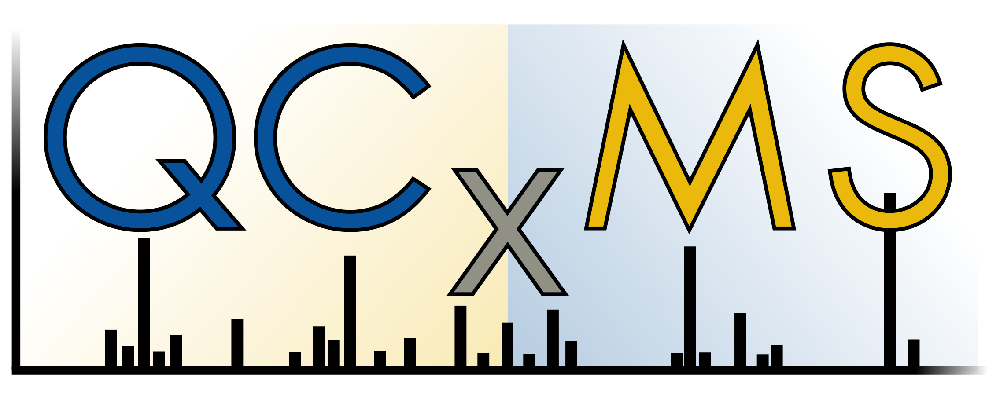

# Workshop on Grimme-Lab Software

Welcome to the Grimme-Lab workshop. This page provides materials and exercises for **xtb**, **CREST**, **CENSO**, and **QCxMS(2)**-related tasks and applications.  

Please use the sidebar on the left to navigate to the programs you're interested in.  

  

    
  

  

    
  

  

    
  

  

    
  

